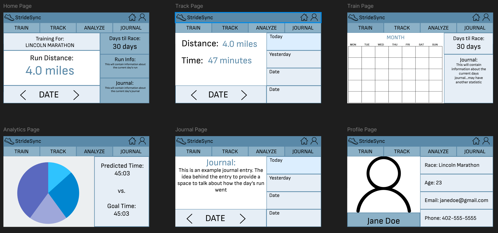

# Freeform

<b>Color Scheme:</b> The color scheme is a monochrome blue. The tones are contrasting as well with darker headers and lighter boxes for areas with more information

<b>Font:</b> The font throughout the design is Sofia Sans. I was considering switching sub-headers and text to a plain sans but I believe the font is basic enough to not need to distinguish

<b>Design:</b>

Overall Layout:

Connections:

Home Page:
 

Track Page:  

 
Train Page:  

 
Analytics Page:  

 
Journal Page:  

Profile Page:

