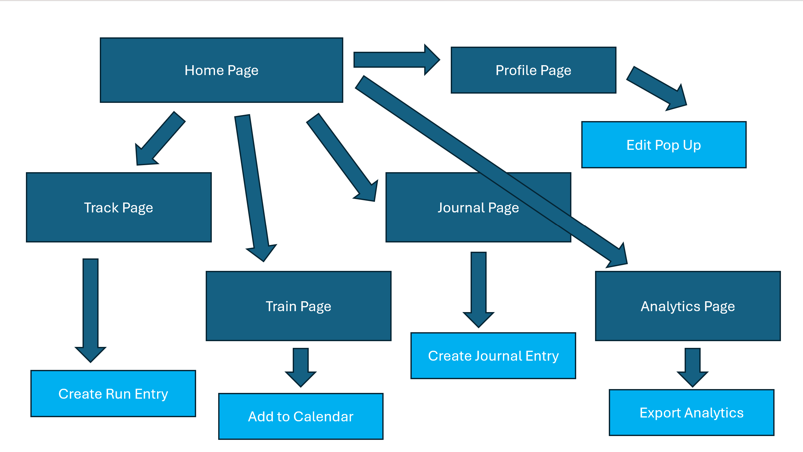

# Freeform

<b>Core Values </b>
1.	<u>Growth:</u>
Growth is an important core value because the app is centered around helping runner push towards their own personal goals. The app should help runners develop their skills and grow through its means of tracking, journaling, and comparisons. Even if runners don’t achieve their set goal, they should still be growing through the app and learning.
2.	<u>Resourcefulness:</u>
Resourcefulness is another important core value because the app should provide adequate information for the users to improve their running experience. A user needs to be able to find any running data easily and be able to compare and analyze their runs for the best results possible. It should be intuitive and not difficult to find.

<b>Integration Values into Design</b>
1.	<u>Growth:</u> The first strategy I will use to signify growth is through the ability to move back and forth between dates. This is represented by the forward and back arrows seen on multiple screens. These signify to the user that they can look at past runs. The second strategy I have is to include the journal and run information on many of the pages so that the user can cross reference these statistics to understand their growth and how they performed in a given day. Finally, the last strategy I will utilize is trackers such as countdowns and progress checks. These will emphasis growth as the user can see how far out their run is or other valuable information.
2.	<u>Resourcefulness:</u> The first strategy I will use to represent this value is through the color scheme. As we discussed in class, blue represents loyalty and trust. By implementing this color in my design, the users are likely to trust the resources I provide and given into the app more. The next strategy I will implement is multiple tabs with distinct purposes. By dividing out the app into sections, the user will be able to observe the specific statistic they want to see. A signifier of this is when you are on a specific tab, it is a darken shade of blue to indicate to the user which page they are on. The third strategy I will utilize is the creation of a profile page. This is a resource for the user because they are able to update the page to best represent themselves and then the resources provided by the app are personalized to them. In addition, every page the user would want to navigate to is represented by a button or tab on every page meaning all the resources are at their fingertips whenever they need it.

<b>List of Pages</b>
-	Home Page, Track Page, Train Page, Analytics Page, Journal Page, Profile Page, Enter Run Entry Pop Up, Enter Journal Entry Pop Up, Enter Profile Information Pop Up, Export Analytics, Add to Calendar

<b>Navigation Tree</b>
