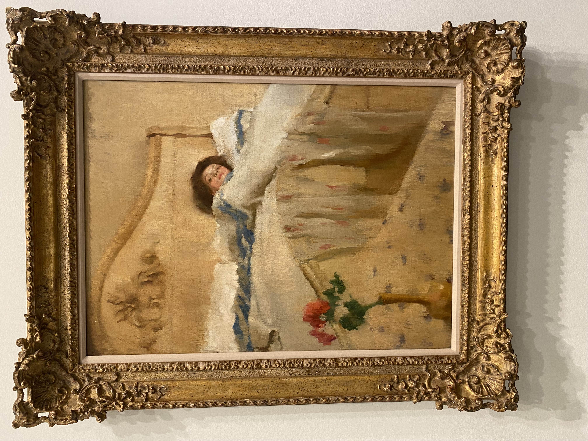
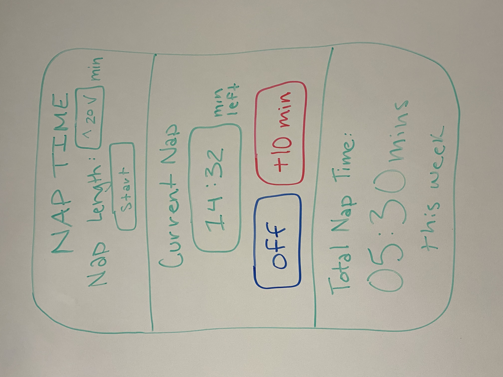

# Freeform

<b>Introduction: </b>I visited the Sheldon Art Museum found on UNL’s campus and enjoyed the surrounding art pieces looking for one that truly caught my eye. This is when I found the following:
The Convalescent by Lillian Westcott Hale

 
<b>Background:</b>
This painting is named the Convalescent by Lillian Westcott Hale. It was created in 1906 and is oil on canvas. Hale stated that the painting is a depiction of her favorite model, Rose Zeffler, lounging in a luxurious bedroom. The purpose of the art was to illustrate the “rest cure” which was a 19th century treatment prescribed by doctors of the period for a variety of “nervous ailments” that were found at the time. 

<b>Art Analysis:</b>
<b>Color Scheme:</b> The first aspect of the artwork that spoke to me was the color scheme, and more specifically the red rose and blue strips on the blanket. The overall color of the artwork is very neutral with lots of browns and golds. The red rose sticks out strongly on this background and draws the viewer’s eye. In addition, red and blue are very contrasting colors, the most possible, and makes the rose stand out even more. This was a smart move by the artist because another colored flower would not have the same emphasis.

<b>Rule of Thirds:</b> The artwork follows the rule of thirds very well and is nicely divided in the vertical aspect. The top third is the top of the room and a brown color, the middle is the white blanket, and the bottom is the area closet to the viewer with more brown tones. In addition, the are two very strong power points in this artwork. First, there is the red rose at the bottom left power point which draws the eye. Secondly, the woman’s face is located at the top right power point which is what caught my eye next. This design makes the artwork very engaging and intriguing to look at. 

<b>Tension:</b> The artwork also displays a lot of tension because of a combination of the elements above. The red and blue are distressing for viewers so that already create a tense viewership. Next, there is tension between the flower and the woman. One principle I have learned is that people follow the eyes of humans in artwork. In this piece, the woman initially feels like she is looking towards the flower but upon closer inspection, she is looking off at nothing and in the distance. I think this truly encapsulates what the piece is about as the flower is bright and lively and the woman seems paler and disconnected to the life around her. This distress between the two power points captures my attention and I can feel the internal struggle of the woman lying in bed.
"Tension." Encyclopaedia Britannica, Encyclopaedia Britannica, Inc. Accessed 1 Oct. 2024, https://www.britannica.com/art/tension-art.

<b>My UI Design:</b>
Looking at this woman lying in a bed began to make me a little sleepy. I made a “Nap Time” app sketch that would encapsulate all of the design principles that I found within Hale’s piece. 
 

The purpose of the app is to allow the user to create “naps” and an alarm will go off when their nap length is over. This then also tracks how much they napped in a week. The app would be used on a phone like the Clock app currently found on the IPhone. The first element included in the app is the rule of thirds. While it was difficult to create power points in the app, I was able to split the app into thirds vertically like the artwork. Next and more apparent is the contrasting color scheme with the blue and red. These two colors will wake a user up because of how harsh the contrast is. This element then ties nicely with the tension element. When a user wakes up from a nap, they will always feel the tension between turning their alarm off and begging for 10 more minutes. This is observed between the red and blue button situated closely together showing both options. 
