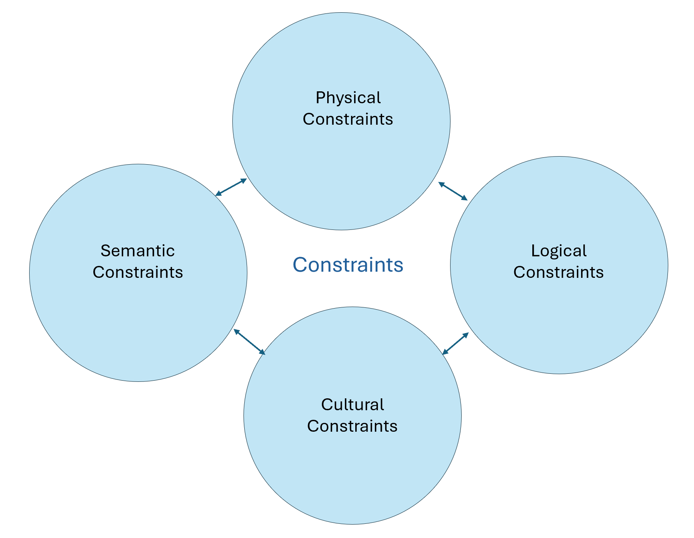

# Concept Map

<b>Constraints and there affect on the User Experience: </b>

Here I mapped out the 4 constraints discussed in the reading. Physical Constraints constrain possible outcomes. Semantic Constraints rely upon the meaning of the sitaution to control the set of possible actions. Cultural constraints rely upon accepted cultural conventions, even if they do not affect the physical or semantic operation of th device. Logical constaints dicted where pieces or actions should go and what the expected outcome of that would be. All of these constraints impact the user in terms of how they interact with a product. The more constraints placed can result in the user having an easy time navigating a webpage for example if there is only one logical path to take but if the user steers off of asumptions this can lead to them getting very stuck. Few constraints can provide the user with more choice and freedom but also can lead to a variety of unexpected results. It is important to rememeber the possible outcome of each constraint placed and how it can affect the user and their experience.