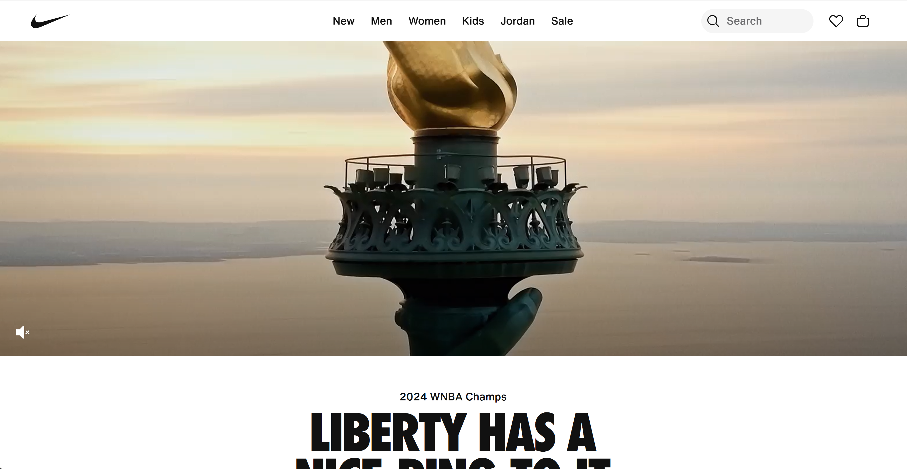

# DirectedAnalysis

The purpose of this reading was to share with the reader how they should stand up to their boss when it comes to design choices. The author further gets his point across by even writing emails that the reader could send to their boss if they deemed it necessary. One of these design choices is when the boss suggests lots of pop-ups and sign-up forms when a user enters a website. While the boss may have good intentions, he probably doesn’t realize how this would be overwhelming for a user and how it leads to a decrease in traffic. The author also makes sure to point out that sometimes these “bad” ideas suggested can be turned into good things with enough brainstorming and testing. 
	
One example of a website that I thought did a good job on their home page was Nike. When you first enter the website, you are not hit with tons of pop-ups and sign-ins. You are able to actually explore the page and find the content you want.

	